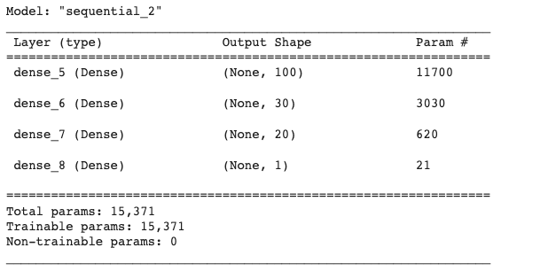

# challenge_13 

## Predicting whether a company is successful for Alphabet Soup funding via neural network. 

 

In this challenge, neural network is used to predict whether applicant for Alphabet Soup Funding will is worth the investment. 

 

## Technical 
---

The complie used the parameters: 'binary_crossentropy', 'adam', and 'accuracy'. 

The fitting of the model used the following paramters:

- epochs = 50 
- batch_size =100 
- shuffle=True

 

## Model 1 
---

### Summary of the model: 

The accuracy of the model was 0.551720142364502. 

The loss of the model was 0.8009347915649414. 

Two optimisation attempts was done to increase the accuracy of the model. 

 

## Model_A1 : 
---

The changes made were: 
- Reduced the hidden layer to 1 (see below summary table for details)
- The output layer was reduced to 1 

### Summary of the model_A1: 

The accuracy of the model was 0.7117201089859009. 

The loss of the model was 1.079923391342163. 

Overall, model_A1 had increased the accuracy. However, the loss had also increased. 

---
 

## Model_A2: 

The changes made were: 
- Hidden layers were increased to 3 (see details in summary table below)
- The output layer was reduced to 1 

### Summary of the model_A2: 

The accuracy of the model was 0.7269970774650574. 

The loss of the model was 0.6093600988388062. 

Overall, the model had improved accuracy and reduced loss. 

